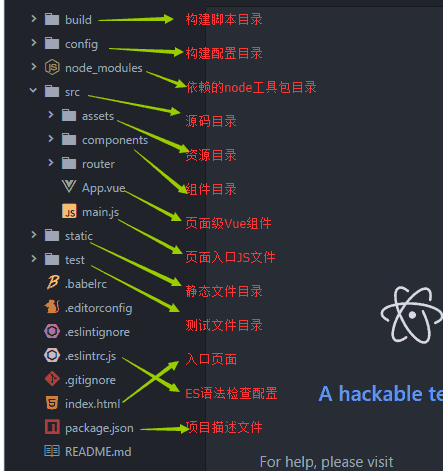

# vue图书商城

> 一个vue图书商城练习项目。

## 使用

克隆项目至本地：

```bash
# clone
git clone https://github.com/Anilway/vue-bookStore.git
```

项目初始化：

```bash
# 在../vue-book/vue-book目录下进行以下初始化操作
# install dependency
npm install

# serve with hot reload at localhost:8080
npm run dev

# build for production with minification
npm run build

# build for production and view the bundle analyzer report
npm run build --report
```

开启后台模拟服务文件：

```bash
# 在../vue-book/vue-book/mock目录下运行
node server.js
```

For a detailed explanation on how things work, check out the [guide](http://vuejs-templates.github.io/webpack/) and [docs for vue-loader](http://vuejs.github.io/vue-loader).

## 项目预览

### 首页


### 列表页


### 详情页


### 购物车


### 添加页


---

> 以下为开发笔记，方便想练习这个项目的童鞋参考。

## 1、初始化项目

初始化项目我们可以在当前项目根目录下，打开cmd，输入命令：

```bash
$ vue init webpack-simple vue-book
```

这样建立的是一个简单的初始化项目文件。一般不足以让我们维护项目。所以，我们一般使用大型项目初始化的方式：

```bash
$ vue init webpack vue-book
```

初始化完成后，会自动建立一个项目结构：



使用vue-cli初始化项目就不需要我们自己配置webpack了。

> 作为拓展，我们可以看看这篇文章：[vue-cli（vue脚手架）超详细教程](https://blog.csdn.net/wulala_hei/article/details/80488674)
>
> 对比一下我们自己学习的。

要注意的是，初始化的项目中，没有less文件，但是已经在webpack中配置好了解析规则。你需要自己下载`less/less-loader`。

## 2、项目结构

我们要建立：

```JavaScript
src // 前台文件
	api        // 代表的是所有的接口
	base       // 基础组件
	components // 页面组件
	router
	App.vue
	main.js
mock  // 后台文件  模拟数据
```

同时，我们还需要下载一些依赖，方便开发时使用：

`less/less-loader/axios/bootstrap/vuex`.

## 3、一些项目小细节

### 路由激活样式:

- `router-link-active` 支持多级路由。`/home`和`/home/xxx`下都能保持一级路由`/home`的激活状态
- `router-link-exact-active` 只支持一级路由，`/home`下能让home保持激活，但是`/home/xxx`就不能保持home的激活。

### 轮播图组件：

- 安装vue-awesome-swiper：https://github.com/surmon-china/vue-awesome-swiper

一个将swpier组件包装成vue组件的项目。

### node模拟请求接口：

```js
let http=require('http');
let fs=require('fs');
let url=require('url');

// 获取轮播图 /sliders
let sliders=require('./sliders.js');

http.createServer(function(req,res){
    let {pathname,query}=url.parse(req.url);
    if(pathname==='/sliders'){
        res.setHeader('Content-type','application/json;charset=utf8');
        res.end(JSON.stringify(sliders));
    }
}).listen(3000);
```

### node跨域头：

参看：[Node.js express 跨域问题](https://cnodejs.org/topic/51dccb43d44cbfa3042752c8)

### axios使用

这里有详细的使用说明：https://github.com/axios/axios

下面看看在vue-book项目中，用到的一些方法。

#### 1、设置默认请求地址

```javascript
// 方便在移动端查看
axios.defaults.baseURL='http://192.168.1.103:3000';
```

教程中请求silders数据使用的是：

```javascript
// Home.vue
import {getSliders} from '../api';
export default{
    async created(){
        // 给data起别名，对象中的属性名字必须和得到的结果名字一致
        let {data:sliders}=await getSliders();
        // 将获取的数据放到sliders中
        this.sliders=sliders;
    },
    data(){
        return{
            sliders:[]
        }
    }
}
```

这个里面用的`async`和`await`我还没有学过，看不懂。但猜测是异步获取数据吧。

#### 2、请求结果拦截

上面的方法获取的结果是一个对象，我们需要的数据存储在对象的data属性里面。这样的话，我们在组件中通过api获取的数据还要进行二次处理才能获取我们真正需要的数据，比较麻烦，代码也多。比如：

```javascript
// 获取热门图书
async getHot(){
    let {data}=await getHotBooks(); // 用解构赋值的方式获取对象中的data数据
    this.hotBooks=data
}
```

其实，axios有一个响应拦截功能，它可以让我们对请求的数据先进行拦截处理，再返回出来。

```javascript
// api/index.js
axiso.interceptors.response.use((res)=>{
    return res.data;// 在这里同一链接结果，把结果处理成res.data
});

export let getHotBooks=()=>{
    return axios.get('/hot');
}
```

这样，我们在组件中获取返回结果的时候，就能直接获取我们需要的结果。页面中的代码也会很简练易读。

#### 3、一次进行多个请求

axios支持多个并发请求。

```javascript
function getUserAccount() {
  return axios.get('/user/12345');
}

function getUserPermissions() {
  return axios.get('/user/12345/permissions');
}

axios.all([getUserAccount(), getUserPermissions()])
  .then(axios.spread(function (acct, perms) {
    // 两个请求现在都执行完成
  }));
```

在这个例子中，我们要请求用户账户和用户许可，可以通过axios同时进行请求。我们可以运用这个特性来对页面的请求添加loading效果。

### 创建组件的基本套路

components目录下存放的是页面组件；base目录下存放的是基础组件，基础组件一般是可以复用的组件。比如底部的tabbar、头部标题栏。

基础组件的创建与使用的基本套路：

- 创建一个.vue文件
- 在需要使用这个组件的父级中引入这个组件
- 在组件中注册
- 以标签的形式引入

如果基础组件需要使用一些数据，我们一般会把数据放在父组件上，然后传给基础组件。因为基础组件是可以复用的，我们不能把数据直接绑定在基础组件上，这样就把数据写死了，别人就不好复用组件。

比如：轮播图组件的轮播数据：

```html
<!--父组件-->
<template>
    <!--在父组件上移标签的形式使用子组件-->
    <!--将父组件上sliders储存的轮播图数据传给子组件的swpierSliders属性。子组件中可以通过props获取父组件的数据，进行数据绑定。这样的话，其他的父组件引入swiper轮播图组件就可以重复使用了，数据是父组件给的嘛！-->
	<Swiper :swiperSliders="sliders"></Swiper>
</template>

<script>
	// 引入子组件，比如轮播图组件swiper
    import Swiper from '../base/swpier.vue';
    export default {
        components:{
            // 在父组件上注册子组件
            Swiper
        },
        data(){
            return{
                sliders:[]
            }
        },
        created(){
            axios.get('http://xxxx').then(res=>{
                // 将轮播图数据放在父组件的sliders属性上
                this.sliders=res.data;
            },err=>{
                console.log(err);
            })
        }
    }
</script>
```

### 在组件中使用less

```html
<style scoped lang="less">
	...
</style>
```

### 弹性布局Flex

> 参考文章：
>
> - [Flex 布局教程：语法篇](http://www.ruanyifeng.com/blog/2015/07/flex-grammar.html)
>
> - [Flex 布局教程：实例篇](http://www.ruanyifeng.com/blog/2015/07/flex-examples.html)

一个基本了解：父元素使用`display:flex`，子元素会自动首行左对齐，很像左浮动。

示例：

我们先写一个基本结构，如下

```html
<div class="box">
    <div class="item"></div>
    <div class="item"></div>
    <div class="item"></div>
</div>
```

再给这些元素添加一些样式：

```css
.box{
    width: 200px;
    height:200px;
    border:1px solid black;
}
.item{
    width: 50px;
    height: 50px;
    background:brown;
    margin:10px;
}
```


再此基础上，我们给.box添加`display=flex`：

```css
.box{
    width: 200px;
    height:200px;
    border:1px solid black;
    display:flex;
}
.item{
    width: 50px;
    height: 50px;
    background:brown;
    margin:10px;
}
```

布局就变成了：


更详细的使用介绍请看阮一峰写的：[Flex 布局教程：实例篇](http://www.ruanyifeng.com/blog/2015/07/flex-examples.html)

### 判断对象是否为空对象

```js
Object.keys(obj).length; // 返回一个数组，数组里是该obj可被枚举的所有属性。
```

可以使用keys判断对象属性的长度。如果为0，则为空对象。

### 关于判断一个变量是否存在

我之前判断一个变量的值是否存在，用的是：

```js
if(a){...}
```

这种方式并不是很严谨。如果a是一个数字，而且a的值刚好等于0，那么a会被隐式转换为false，而不能执行判断体中的代码。所以，更严谨的方式是判断a是不是`undefined`。如果是undefined，a就不存在。

你也许会想，那a等于null呢？a=null，说明a是存在的，只是还没有赋值。如果使用a，a为undefined，就说明a压根不存在，还没有定义。

所以，更严谨的判断一个变量是否存在，最好使用：

```js
if(typeof id !=='undefined'){...}
```

### 添加loading效果

为我们的vue-book添加loading效果。


如图是现在的vue-book的完成情况，我们现在想实现的效果是对首页添加loading效果，而列表页、收藏页、添加页不需要loading效果。

因为首页需要缓存，后面几页不需要缓存，列表页是实时更新的，我们还可以手动更新。

现在我们来看看首页如何实现loading效果。那肯定是在axios请求数据完成前，我们给页面添加loading动画，请求结束后，取消loading动画。原理很简单。但是，现在的情况是我们在首页进行了两次请求（轮播图的数据请求和热门图书的数据请求）。请求是异步的，对于两次独立的axios请求，我们不能保证它们能同时完成。

所以，我们需要使用axios的all方法进行多并发请求，既通过axios，一次完成多个数据请求，请求完成了，就意味着两个请求都完成了。

```javascript
// api/index.js
// 获取轮播图数据和热门图书数据
let getSliders=function(){
    return axios.get('/sliders');
};

let getHotBook=()=>{
    return axios.get('/hot');
};

export let getAll=()=>{
    return axios.all([getSliders(),getHotBook()]);
};
```

在Home.vue中获取数据：

```javascript
import {getAll} from "../api";

exports default {
    created(){
    this.getData();
    },
    data() {
        return {
        	sliders:[],
            hotBooks:[],
            loading:true
    	}
    },
    methods: {
        async getData(){
            let [sliders,hotBooks]=await getAll();
            this.sliders=sliders.data;
            this.hotBooks=hotBooks.data;
            // 数据获取完毕
            this.loading=false;
        }
    }
}
```

接着我们要添加loading效果。我们给Home.vue中添加一个loading数据，默认为true，等到数据加载完之后就设为false。我们用来控制loading动画。

控制原理：

```html
<loading v-if='laoding'></loading>
<template v-else>
	<Swiper :data="sliders"></Swiper>
    <div class="hotTop">
        ...
    </div>
</template>
```

我们给页面添加一个loading组件，需要加载数据的部分用template标签包起来。用`v-if`和`v-else`指令控制。

> 参考：[使用 CSS3 实现超炫的 Loading（加载）动画效果](https://www.cnblogs.com/lhb25/p/loading-spinners-animated-with-css3.html)
>
> 可以直接条用里面的代码添加loading组件。

### 实现页面缓存（路由原信息实现分页缓存）

在完成loading效果之后，还有一个问题，首页数据没有缓存，每次切换回来都要重新获取数据。


这样就不合理了。首页的数据加载完之后一般是不变的，最好是将首页数据缓存起来。

我们之前学过使用`<keep-alive>`标签将标签、数据缓存起来。但是现在的问题是这么多页面，这么多标签，有些是不需要换粗的（比如列表页），有些是需要缓存的。最好是能分页缓存最好。

> 查看官方文档：[路由元信息](https://router.vuejs.org/zh/guide/advanced/meta.html)

我们可以使用路由元信息进行备注：

```js
routes:[
        {path:"/",redirect:"/home"},
    // Home需要缓存，就添加meta信息。通过this.$route.meta.keepAlive来获取值
    // meta对象的属性是我们自定义的，比如keepAlive
        {path:'/home',component:Home,meta:{keepAlive:true,title:'首页'}},
        {path:'/list',component:List,.meta:{title:'列表'}},
        {path:'/detail/:uid',component:Detail,name:"detail"，meta:{title:'详情'}},
        {path:'/collect',component:Collect，meta:{title:'收藏'}},
        {path:'/add',component:Add，meta:{title:'添加'}},
        {path:'*',redirect:'/home'}
    ]
```

我们的页面是通过`<router-view>`进行缓存的，所以，我们要对这个标签进行缓存。但是直接缓存，就会让所有的页面都会进行缓存。所以，我们可以通过元信息进行判断。

```html
<!--需要缓存的页面-->
<keep-alive>
    <router-view v-if="$route.meta.keepAlive"></router-view>
</keep-alive>
<!--不需要缓存的页面-->
<router-view v-if="!$route.meta.keepAlive"></router-view>
```


### 页面标签名设置（router全局钩子）

在上面设置页面缓存的时候，我们给每个路由也添加了title信息。我们希望实现的是在切换页面的时候，每个页面的标签也跟着切换显示当前页面的名称。


我们可以根据每个路由的元信息，在每个路由页面里面设置：

```js
// Home.vue
created(){
    document.title=this.$route.meta.title;
}
```

这样可以实现，但是这样很麻烦，如果我有成百个页面组件，那就需要在每个组件里面设置一次。

这种情况，我们可以使用[router的全局钩子beforeEach](https://router.vuejs.org/zh/api/#router-beforeeach)。

>参考：
>
>- [router的全局钩子beforeEach](https://router.vuejs.org/zh/api/#router-beforeeach)
>
>- [导航首尾](https://router.vuejs.org/zh/guide/advanced/navigation-guards.html)
>
>```js
>router.beforeEach((to, from, next) => {
>  /* must call `next` */
>})
>```
>
>## 全局守卫
>
>你可以使用 `router.beforeEach` 注册一个全局前置守卫：
>
>```js
>const router = new VueRouter({ ... })
>
>router.beforeEach((to, from, next) => {
>  // ...
>})
>```
>
>当一个导航触发时，全局前置守卫按照创建顺序调用。守卫是异步解析执行，此时导航在所有守卫 resolve 完之前一直处于 **等待中**。
>
>每个守卫方法接收三个参数：
>
>- **to: Route**: 即将要进入的目标 [路由对象](https://router.vuejs.org/zh/api/#%E8%B7%AF%E7%94%B1%E5%AF%B9%E8%B1%A1)
>- **from: Route**: 当前导航正要离开的路由
>- **next: Function**: 一定要调用该方法来 **resolve** 这个钩子。执行效果依赖 `next` 方法的调用参数。
>  - **next()**: 进行管道中的下一个钩子。如果全部钩子执行完了，则导航的状态就是 **confirmed** (确认的)。
>  - **next(false)**: 中断当前的导航。如果浏览器的 URL 改变了 (可能是用户手动或者浏览器后退按钮)，那么 URL 地址会重置到 `from` 路由对应的地址。
>  - **next('/') 或者 next({ path: '/' })**: 跳转到一个不同的地址。当前的导航被中断，然后进行一个新的导航。你可以向 `next` 传递任意位置对象，且允许设置诸如 `replace: true`、`name: 'home'` 之类的选项以及任何用在 [`router-link` 的 `to` prop](https://router.vuejs.org/zh/api/#to) 或 [`router.push`](https://router.vuejs.org/zh/api/#router-push) 中的选项。
>  - **next(error)**: (2.4.0+) 如果传入 `next` 的参数是一个 `Error` 实例，则导航会被终止且该错误会被传递给 [`router.onError()`](https://router.vuejs.org/zh/api/#router-onerror) 注册过的回调。
>
>**确保要调用 next 方法，否则钩子就不会被 resolved。**

我们可以把`router.beforeEach()`理解为，每次在进入路由之前，都会执行此方法。

```js
router.beforeEach((to,from,next)=>{
    console.log(to);
});
```

beforeEach里面接收一个回调函数。这个回调函数里面有三个参数。其中第一个参数代表当前要进入的路由对象。打印如下：


我现在要点击的是home页，所以在进入之前，执行beforeEach，得到home路由对象。可以看到里面保存了path、我们设置的原信息等。

from参数代表的是当前要离开的路由。比如我现在在list，要进入home。那么to代表要进入的home路由对象，from代表当前我所在的list路由对象。

第三个参数`next`是一个函数，代表继续执行。当我们使用beforeEach方法的时候，要在里面执行next方法，才会继续往下执行。否则整个项目就止步在此了。

了解了这些，现在我们来实现项目的需求，显示每一页，每个页面的标签标题也变成我们需要的标题：

```js
// main.js
router.beforeEach((to,from,next)=>{
    document.title=to.meta.title;
    next();
});
```


因为beforeEach是router的全局方法，所有，要写在主文件中。

#### 拦截功能

beforeEach的功能很强大，还可以拦截路由。来实现某些权限设置。

比如，我想设置添加图书的权限。当进入添加图书页面前，转跳列表页面。

```js
router.beforeEach((to,from,next)=>{
    //document.title=to.meta.title;
    if(to.path==='/add'){
        next({path:'/list'});
    }else{
        next();
    }
});
```


### 实现路由动画

给`<router-view>`标签添加`<transition>`标签，添加动画样式即可。

```html
<!--需要缓存的页面-->
<transition name="fadeIn">
    <keep-alive>
        <router-view v-if="$route.meta.keepAlive"></router-view>
    </keep-alive>
</transition>
<!--不需要缓存的页面-->
<transition name="fadeIn">
	<router-view v-if="!$route.meta.keepAlive"></router-view>
</transition>
```

动画样式：

```css
.fadeIn-enter{opacity:0;}
.fadeIn-enter-active{transition:all 0.3s linear;}
.fadeIn-leave-active{transition:all 0.3s linear;opacity:0;}
```


### 加载更多

**后台设置**

- 每次加载给5条信息，前端告诉后台现在要从第几条开始给我
- `/page?offset=5`
- 后台返回还要告诉前端是否有更多的数据`hasMore:true/false`

**前台实现**

- 可以通过添加加载按钮实现：


通过点击按钮，给点击按钮添加一个more事件方法，在more方法中调用`this.getData()`方法获取数据。

要注意的是避免重复调用`this.getData`方法。在加载中时，就点击按钮，禁止加载。可通过设定`isLoading`参数进行判断，默认为false没有加载。当数据在加载时，就设`isLoading`为true，当isLoading为true，就不能加载。

部分代码：

```html
<!--我是给一个li标签添加点击事件的-->
<li class="addmore" @click="more">{{msg}}</li>
```

```js
data() {
    return {
        books:[],
        offset:0, // 偏移量
        hasMore:true, // 是否有更多
        isLoading:false,
        msg:'点击加载更多'
    }
},
methods: {
    more(){
        if(!this.hasMore){
            this.msg="已加载到底部";
            return;
        }
        this.getData();
    },
    async getData(){
        if(this.hasMore && !this.isLoading){
            this.msg="加载中..."
            this.isLoading=true;
            let {data}=await pagination(this.offset);
            this.books=[...this.books,...data.books];
            this.hasMore=data.hasMore;
            this.offset=this.books.length;// 维护偏移量，就是总数的长度
            this.isLoading=false;
            this.msg="点击加载更多";
        }
    }     
}    
```

这里也给了getData的方法。主要是通过more方法来实现点击加载数据的。然后看看li中的提示信息的变化是怎么设置的。

- 还可以通过滚动加载

```javascript
scrollTop+容器.clientHeight+20>=容器.scrollHeight
```

给可视区容器添加scroll事件。当满足上面这个条件时，就执行`this.getData()`获取数据。

要注意的是避免重复调用。要加上防抖、节流措施。防抖前后效果对比：


防抖的原理也很简单，就是在触发滚动事件后执行事件方法时，在方法里面用定时器延迟执行。每次开启定时器前先清除上一次的定时器。

代码：

```html
<!--给容器绑定事件，用ref获取元素-->
<div class="container" ref='scroll' @scroll='loadMore'></div>    
```

```js
methods: {
    loadMore(){
        // 先清除上一次的定时器
        clearTimeout(this.timer);
        this.timer=setTimeout(()=>{
            // 通过this.$refs来获取元素，因为我们在元素标签里面设置的ref='scroll'，所以这里是this.$refs.scroll表示容器元素。然后通过解构赋值的方式获取我们需要的值进行判断是否需要加载数据
            let {scrollTop,scrollHeight,clientHeight}=this.$refs.scroll;
            if(scrollTop+clientHeight+20>scrollHeight){
                this.getData();// 这个方法是通过axios获取数据的
            }
        },50);
    }
}
```

还有一种不建议的写法，不通过v-on绑定事件，自己给获取的容器绑定事件。这样就和原生JS差不多了。

```js
this.$refs.scroll.addEventListener('scroll',function(){
    ...
},false);
```

滚动加载效果：


### 下拉刷新

下拉刷新原理：


下拉细节处理：

- 从上往下拉才执行（下拉距离必须为正数才行）
- 限制下拉距离，不能一直拉到头（可以允许下拉150px）
- 松手后，内容部分要回到原位置（touchend事件干的事）


### 图片懒加载

有一个现成的vue-lazyload插件可以使用。[点击查看](https://github.com/hilongjw/vue-lazyload)

使用：

```js
// 导入图片懒加载
import VueLazyload from 'vue-lazyload'
Vue.use(VueLazyload,{
    preload:1.3,
    error:'assets/error.PNG',
    loading:'assets/loading.gif',
    attempt:1
});

// 把真实的地址放在v-lazy指令中即可

```

## 4、发布项目

### 代码分割

coding split

> 官方文档：[路由懒加载](https://router.vuejs.org/zh/guide/advanced/lazy-loading.html)
>
> 当打包构建应用时，Javascript 包会变得非常大，影响页面加载。如果我们能把不同路由对应的组件分割成不同的代码块，然后当路由被访问的时候才加载对应组件，这样就更加高效了。
>
> 结合 Vue 的[异步组件](https://cn.vuejs.org/v2/guide/components-dynamic-async.html#%E5%BC%82%E6%AD%A5%E7%BB%84%E4%BB%B6)和 Webpack 的[代码分割功能](https://doc.webpack-china.org/guides/code-splitting-async/#require-ensure-/)，轻松实现路由组件的懒加载。
>
> ###### ……

原先我们的路由是这么写的：

```js
import Vue from 'vue';
import VueRouter from 'vue-router';

import Home from '../components/Home.vue';
import List from '../components/List.vue';
import Collect from '../components/Collect.vue';
import Add from '../components/Add.vue';
import Detail from '../components/Detail.vue';

Vue.use(VueRouter);
let router=new VueRouter({
    routes:[
        {path:"/",redirect:"/home"},
        {path:'/home',component:Home,meta:{keepAlive:true}},
        {path:'/list',component:List},
        {path:'/detail/:uid',component:Detail,name:"detail"},
        {path:'/collect',component:Collect},
        {path:'/add',component:Add},
        {path:'*',redirect:'/home'}
    ]
});

export default router;
```

这种写法，在问价打包的时候，会把所有的文件打包成一个整体，文件会非常大，这样在加载页面时，可能会影响用户体验。


所以，最好是根据访问的路由不同，动态加载每个页面的js文件。

写法如下：

```javascript
import Vue from 'vue';
import VueRouter from 'vue-router';

Vue.use(VueRouter);
let router=new VueRouter({
    routes:[
        {path:"/",redirect:"/home"},
        {
            path:'/home',
            component:()=>import('../components/Home.vue'),
            meta:{keepAlive:true}
        },
        {
            path:'/list',
            component:()=>import('../components/List.vue')
        },
        {
            path:'/detail/:uid',
            component:()=>import('../components/Detail.vue'),
            name:"detail"
        },
        {
            path:'/collect',
            component:()=>import('../components/Collect.vue')
        },
        {
            path:'/add',
            component:()=>import('../components/Add.vue')
        },
        {path:'*',redirect:'/home'}
    ]
});

export default router;
```

删掉了原来引入路由的方式。在components中用一个函数来引入路由。


### 项目打包

```bash
npm run build
```

### 项目配置

将打包后，dist文件夹中的文件复制到mock文件夹中。并对mock文件中的server.js进行配置。

**在服务器文件上读一个路径：**

```js
// 读取一个路径
fs.stat('.'+pathname,function(err,stats){
    if(err){
        res.statusCode=404;
        res.end("NOT FOUND");
    }else{ // 如果是目录会报错
        if(stats.isDirectory()){
            let p=require('path').join('.'+pathname,'./index.html');
            fs.createReadStream(p).pipe(res);
        }else{
            fs.createReadStream('.'+pathname).pipe(res);
        }

    }
});
```

因为我们的服务器文件和项目文件现在在同一个目录下，所以不存在跨域问题，可以把跨域请求头删掉。

另外，因为现在我们默认就是在localhost:3000这个目录下读取文件的，所以，其实api文件中的：

```js
// api/index.js
// 增加默认路径
// axios.defaults.baseURL="http://loaclhost:3000";
```

是不需要的。所以，我们删掉这一行。

**修改路由模式**

上线项目，一般路由使用的是`history`模式：

```javascript
// router/index.js
let router=new VueRouter({
    mode:'history', // 添加路由模式
    routes:[...]
};
```

这样的话，我们就需要把server.js中的服务器文件修改一下，因为我们的路径上面的地址是假的，如果服务器没有设置，刷新这个地址是无法返回静态页面的。

设置就是，当找不到文件时，返回home页。因为我们这里是SPA单页应用，所以刷新后看起来还是这个地址。

```js
// server.js设置
// 读取一个路径
fs.stat('.'+pathname,function(err,stats){
    if(err){
        // res.statusCode=404;
        // res.end("NOT FOUND");
        fs.createReadStream('index.html').pipe(res);
    }else{ // 如果是目录会报错
        if(stats.isDirectory()){
            let p=require('path').join('.'+pathname,'./index.html');
            fs.createReadStream(p).pipe(res);
        }else{
            fs.createReadStream('.'+pathname).pipe(res);
        }
    }
});
```

然后重新打包一下，把新打包后的项目文件重新放在mock文件下即可。

### 项目上线

现在我们的项目文件就准备好了。只需要把mock文件夹放在服务器上，在服务器是用node运行server.js就算是项目上线了。


